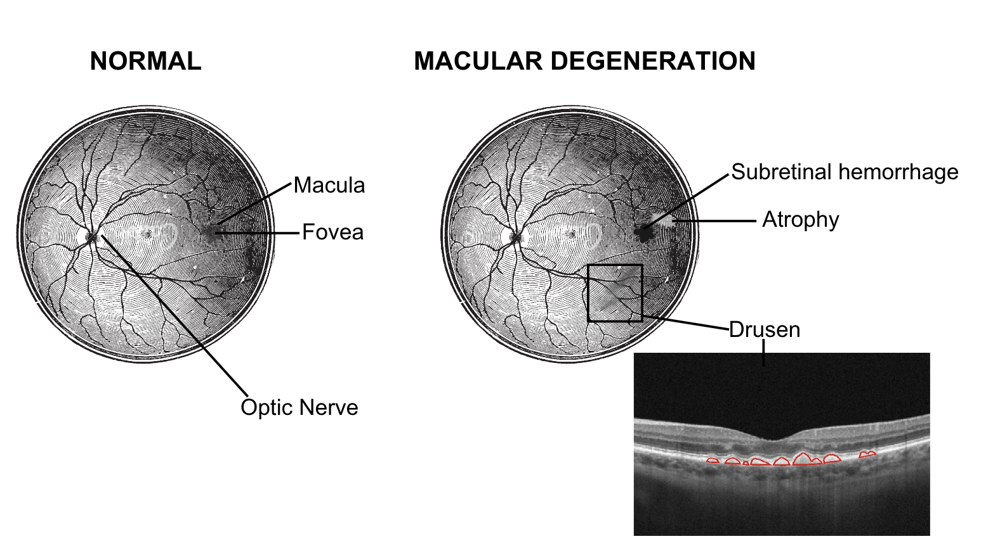
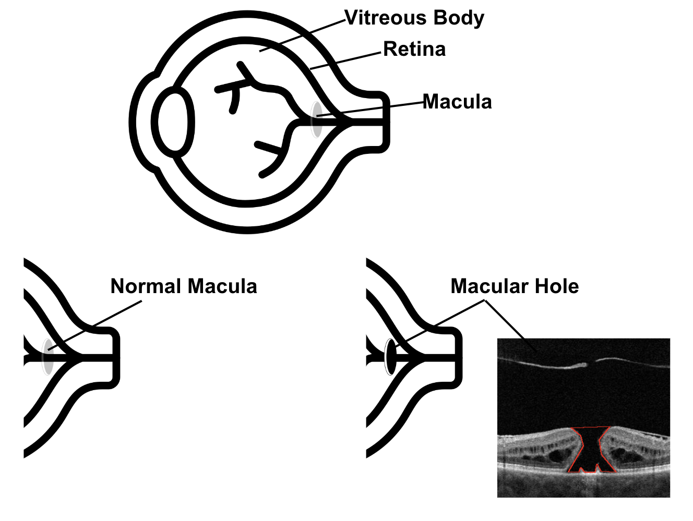

## Motivation

Age-related Macular Degeneration (AMD) and Macular Hole are leading causes of vision loss.  
Timely detection of retinal biomarkers such as drusen, subretinal/intraretinal fluid, and tissue defects is critical for diagnosis and treatment. Manual annotation of OCT scans is time-consuming and subjective, motivating the need for automated deep learning–based segmentation.

  <table>
    <tr>
      <td align="center">
         
        <b>Normal vs AMD retina</b>
      </td>
      <td align="center">
         
        <b>Normal vs Macular Hole retina</b>
      </td>
    </tr>
  </table>

