## Motivation

Age-related Macular Degeneration (AMD) and Macular Hole are leading causes of vision loss.  
Timely detection of retinal biomarkers such as drusen, subretinal/intraretinal fluid, and tissue defects is critical for diagnosis and treatment. Manual annotation of OCT scans is time-consuming and subjective, motivating the need for automated deep learning–based segmentation.

<div>
  <table>
    <tr>
      <td align="center">
        <br>
        <b>Normal vs AMD retina</b>
      </td>
      <td align="center">
        <br>
        <b>Normal vs Macular Hole retina</b>
      </td>
    </tr>
  </table>
</div>

## Dataset & Preprocessing

**Datasets used**  
This project evaluates two OCT datasets: **AMD** and **Macular Hole**. Each dataset contains manually annotated B-scans with pixel-wise masks for clinically relevant biomarkers (drusen, intra-/sub-retinal fluid, tissue defects). A small set of sample images is included in `data/sample_images/` for quick inspection.

<div>
  <table>
    <tr>
      <td align="center">
        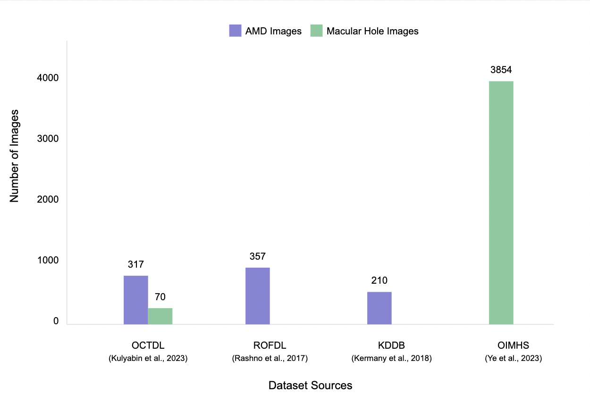<br>
        <b>Dataset overview</b>
      </td>
      <td align="center">
        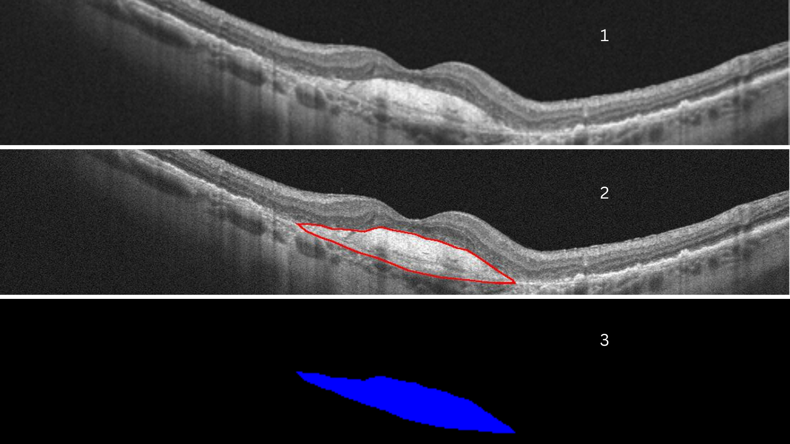<br>
        <b>Annotation (input / mask)</b>
      </td>
    </tr>
  </table>
</div>

**Preprocessing & augmentation**  
Images were standardized with intensity normalization and resized/cropped to fixed input dimensions. Typical pipeline steps: cropping to region-of-interest, intensity scaling, and data augmentation (random flips, rotations, contrast variations) during training to improve generalization.

<div>
  <table>
    <tr>
      <td align="center">
        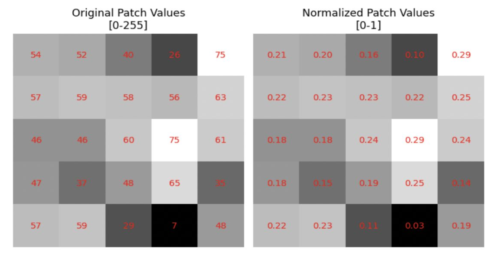<br>
        <b>Preprocessing pipeline</b>
      </td>
      <td align="center">
        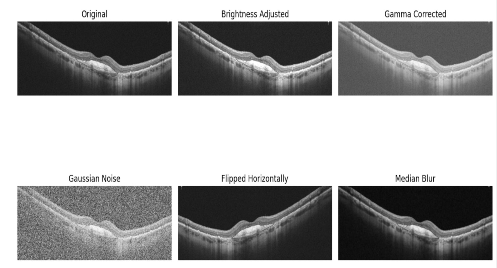<br>
        <b>Augmentation examples</b>
      </td>
    </tr>
  </table>
</div>

## Methodology — Models & Architectures

We implemented multiple encoder–decoder segmentation architectures (U-Net family) and evaluated an automated nnU-Net pipeline.

<div>
  <table>
    <tr>
      <td align="center">
        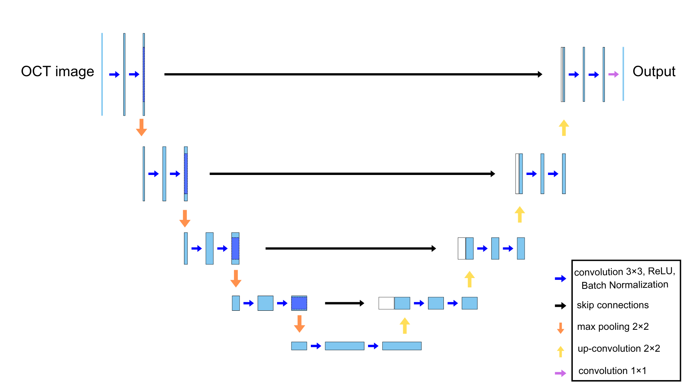<br>
        <b>U-Net</b>
      </td>
      <td align="center">
        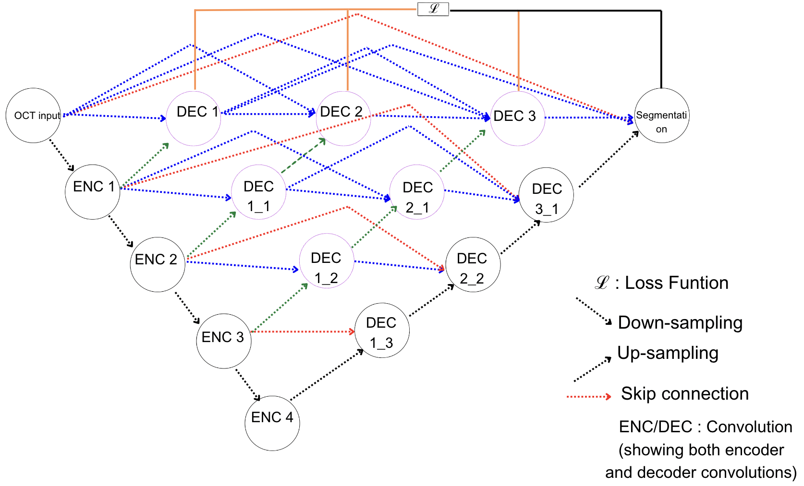<br>
        <b>U-Net++</b>
      </td>
    </tr>
    <tr>
      <td align="center">
        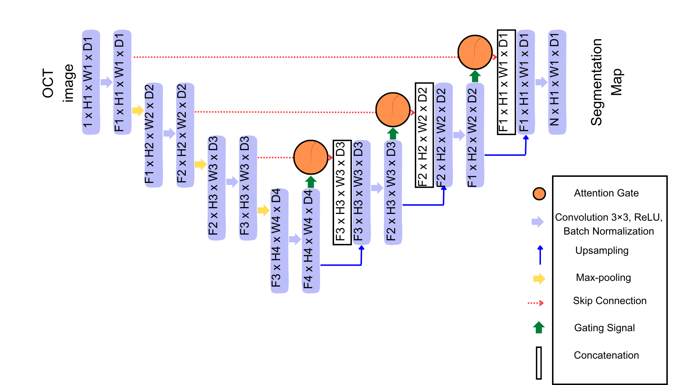<br>
        <b>Attention U-Net</b>
      </td>
      <td align="center">
        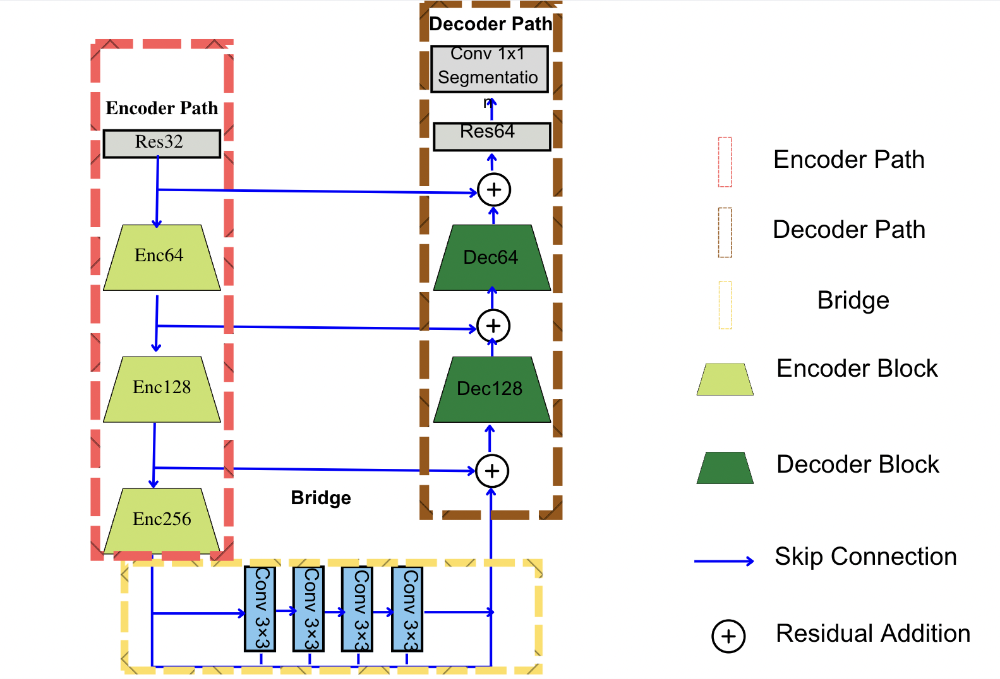<br>
        <b>Deep ResU-Net</b>
      </td>
    </tr>
    <tr>
      <td colspan="2" align="center">
        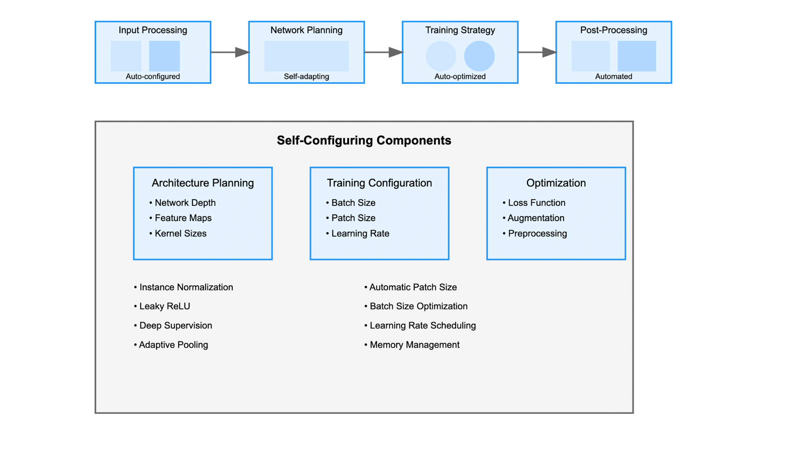<br>
        <b>nnU-Net pipeline (automated preprocessing & training)</b>
      </td>
    </tr>
  </table>
</div>

### Training summary (short)
- **Input size:** 512 × 512 (resampled/cropped).  
- **Loss:** Cross-entropy / Dice combo (as used in experiments).  
- **Optimizer:** Adam, lr = 1e-4 (ReduceLROnPlateau).  
- **Batch size:** 32.  
- **Epochs:** up to 100 with early stopping (patience 5).  
- **Augmentation:** Random flips, rotations, brightness/contrast, random crops.  

## Results

This section summarizes quantitative results (Mean IoU and Mean Dice) reported in the thesis (Table 5.1 for AMD, Table 5.3 for Macular Hole). Full numeric CSVs are in `results/`.

### AMD — Model performance (Table 5.1)
| Model | Mean IoU (no aug) | Mean Dice (no aug) | Mean IoU (with aug) | Mean Dice (with aug) |
|---|---:|---:|---:|---:|
| U-Net | 0.7178 | 0.7695 | 0.7417 | 0.7992 |
| U-Net++ | 0.6757 | 0.7289 | 0.7017 | 0.7565 |
| Attention U-Net | 0.6679 | 0.7218 | 0.6904 | 0.7456 |
| Deep ResU-Net | 0.6960 | 0.7553 | 0.7161 | 0.7704 |
| nnU-Net | 0.7755 | 0.8321 | 0.7988 | 0.8543 |

> Download CSV: [results/amd/model_performance.csv](results/amd/model_performance.csv)

**Representative visuals**  
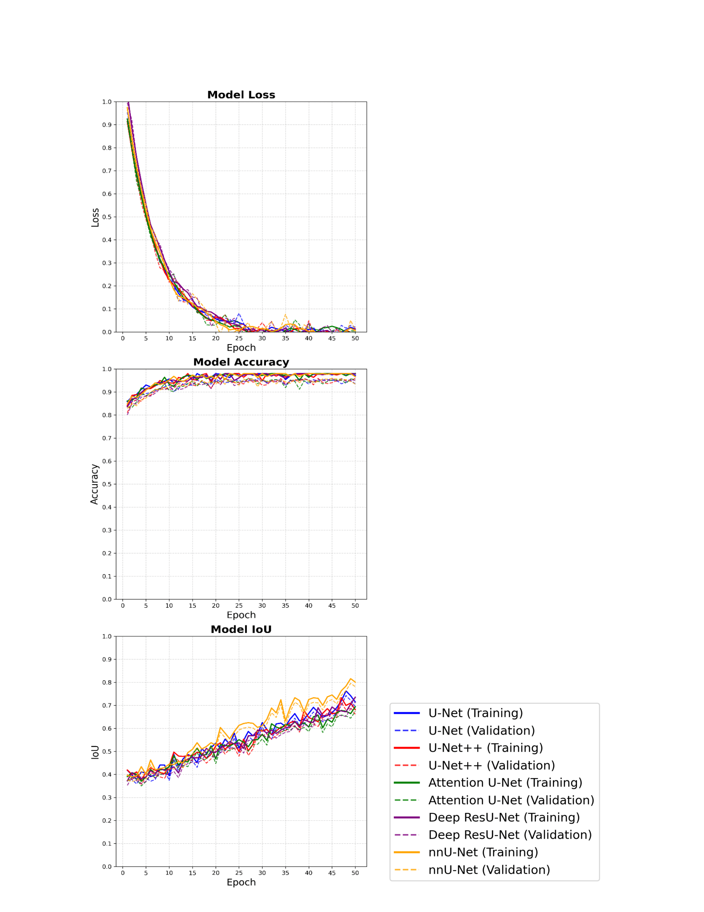  
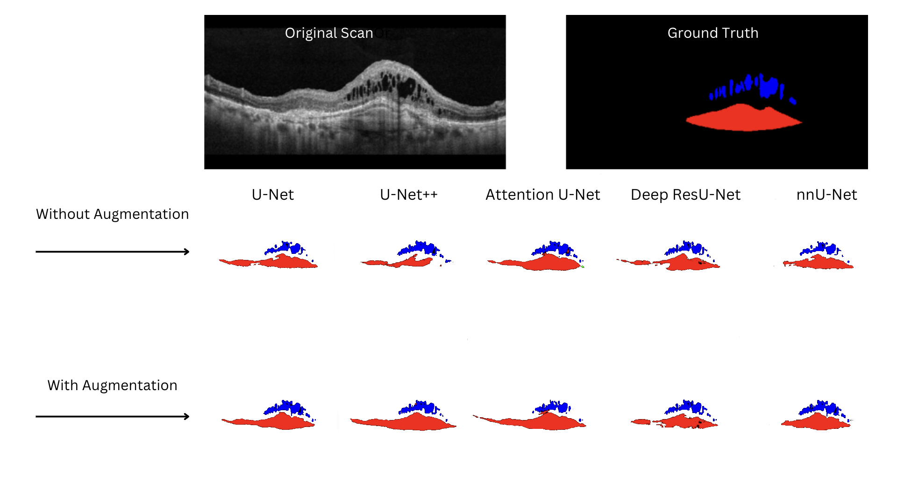

---

### Macular Hole — Model performance (Table 5.3)
| Model | Mean IoU (no aug) | Mean Dice (no aug) | Mean IoU (with aug) | Mean Dice (with aug) |
|---|---:|---:|---:|---:|
| U-Net | 0.7967 | 0.8592 | 0.8250 | 0.8759 |
| U-Net++ | 0.7204 | 0.8179 | 0.7425 | 0.8389 |
| Attention U-Net | 0.8088 | 0.8782 | 0.8324 | 0.8983 |
| Deep ResU-Net | 0.7567 | 0.8349 | 0.7802 | 0.8546 |
| nnU-Net | 0.8188 | 0.8892 | 0.8421 | 0.9088 |

> Download CSV: [results/macular_hole/model_performance.csv](results/macular_hole/model_performance.csv)

**Representative visuals**  
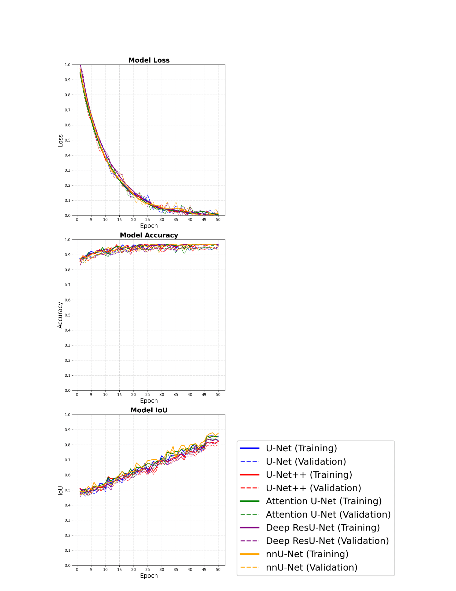  
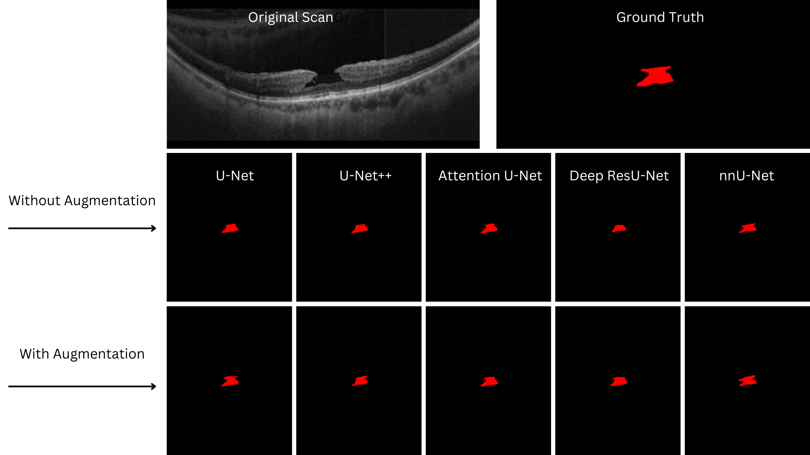

---

**Notes**
- The CSVs include the exact numbers reported in the thesis (Table 5.1 and Table 5.3).  
- For full experimental details and additional per-fold metrics, see the thesis PDF in this repo.

## How to Run / Reproduce

### Requirements
- Python 3.8+
- PyTorch ≥ 1.10
- torchvision
- nibabel (for `.nii.gz` OCT volumes)
- matplotlib, numpy, scikit-learn

### Installation
Clone this repository and install dependencies:

```bash
git clone https://github.com/Keshav0781/OCT-Biomarker-Segmentation.git
cd OCT-Biomarker-Segmentation
pip install -r requirements.txt
```
